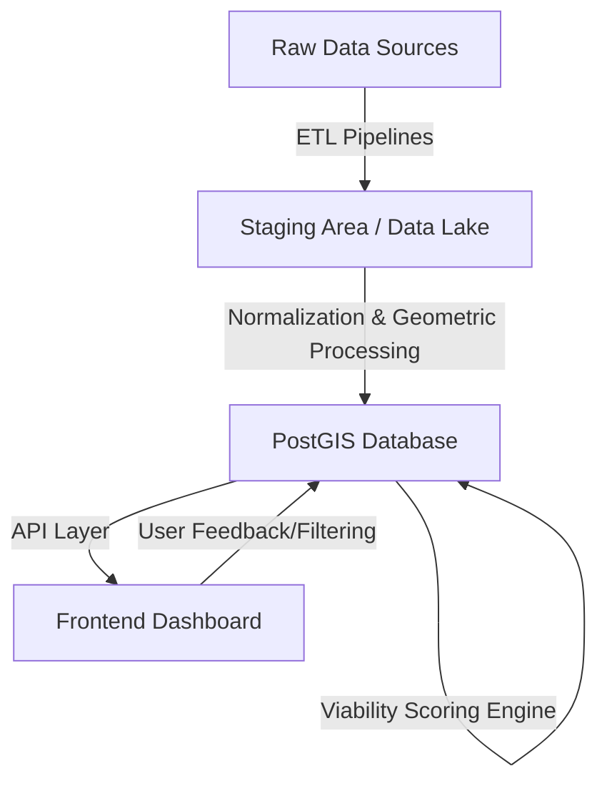

# Apollo Architecture & System Design

## 1. Vision & Overview
Apollo is a high-performance **Solar Site Selection System** for Massachusetts. It automates the identification of viable solar development sites by ingesting, normalizing, and analyzing geospatial data against strict interconnection, zoning, environmental, and physical constraints.

**Goal:** A "Single Pane of Glass" GIS dashboard where a user can filter parcels by "Viability Score" and drill down into specific constraints (e.g., "Show me all parcels > 5 acres, within 1km of a substation, on a green circuit, with no wetlands").

## 2. System Architecture

### High-Level Data Flow


### Technology Stack
*   **Database:** **PostgreSQL + PostGIS**. This is non-negotiable for spatial joins, buffer analysis, and fast geometric queries.
*   **ETL & Compute Layer:** **Python**.
    *   *Libs:* `GeoPandas` (vector), `Rasterio` (raster/slope), `PDAL` (LiDAR), `SQLAlchemy`.
    *   *Orchestration:* `Dagster` or simple Cron/Script-based runners for MVP.
*   **API:** **FastAPI** (Python) or **Node.js**. Python is preferred to share logic with the compute layer.
*   **Frontend:** **Next.js (React)** + **Mapbox GL JS** (or MapLibre). Mapbox handles large vector tile sets better than Leaflet.

## 3. The "Universal Parcel Record"
The core unit of analysis is the **Parcel**. We will hydrate a master `parcels` table with attributes from all other layers.

**Schema Concept:**
```sql
TABLE parcels (
    id SERIAL PRIMARY KEY,
    massgis_id VARCHAR UNIQUE, -- Link to official records
    geom GEOMETRY(Polygon, 4326), -- Spatial boundary
    
    -- Attributes (often JSONB for flexibility)
    basic_info JSONB, -- { owner, address, town, acres }
    
    -- Computed Constraints
    grid_status JSONB, -- { utility, circuit_id, capacity_mw, distance_substation_km }
    zoning_status JSONB, -- { zone_code, allowed_use, max_coverage }
    enviro_status JSONB, -- { wetland_overlap_pct, priority_habitat, flood_zone }
    physical_status JSONB, -- { avg_slope, aspect, bedrock_depth }
    
    -- Scoring
    viability_score FLOAT, -- 0.0 to 1.0
    flags TEXT[] -- ['CRITICAL_FAIL_WETLANDS', 'FAIL_GRID_SATURATED']
);
```

## 4. Ingestion Strategy
We will build modular **Ingestion Agents** (scripts) for each domain.

| Domain | Source Type | Frequency | Strategy |
| :--- | :--- | :--- | :--- |
| **Base Parcels** | MassGIS (WFS/Download) | Quarterly | Full refresh or diff update. |
| **Grid** | Utility Portals (ArcGIS REST/CSV) | Monthly | Scrapers/API clients. Critical for "Green" status. |
| **Zoning** | Town Bylaws (PDF/Text) + GIS | Ad-hoc | **Hybrid:** GIS for district boundaries, LLM for text analysis of bylaws. |
| **Environment** | MassGIS (WFS) | Semi-Annual | Spatial join layers (Wetlands, NHESP). |
| **Topography** | USGS/MassGIS LiDAR | One-time | Heavy raster processing (Slope/Aspect generation). |

## 5. Directory Structure & Modules
*   `pipelines/01_grid/`: Scrapers for National Grid/Eversource hosting maps.
*   `pipelines/02_zoning/`: Bylaw text extraction & Zoning district mapping.
*   `pipelines/03_environmental/`: Constraints analysis (wetlands, habitats).
*   `pipelines/04_physical/`: Slope/Aspect analysis from LiDAR/DEM.
*   `pipelines/05_infrastructure/`: Road frontage, access, scenic roads.
*   `pipelines/06_legal_social/`: Ownership, easements, abutter density.

## 6. Development Workflow
1.  **Define Spec:** Write `REQUIREMENTS.md` for a module (e.g., Grid).
2.  **Build Scraper/Fetcher:** Script to download raw data to `data/raw/`.
3.  **Build Processor:** Script to clean and load into PostGIS `data/processed/`.
4.  **Build Analyzer:** Script to run spatial queries (e.g., "Is parcel within 100ft of wetland?") and update the `parcels` table.
5.  **Visualize:** Verify on the dashboard.
